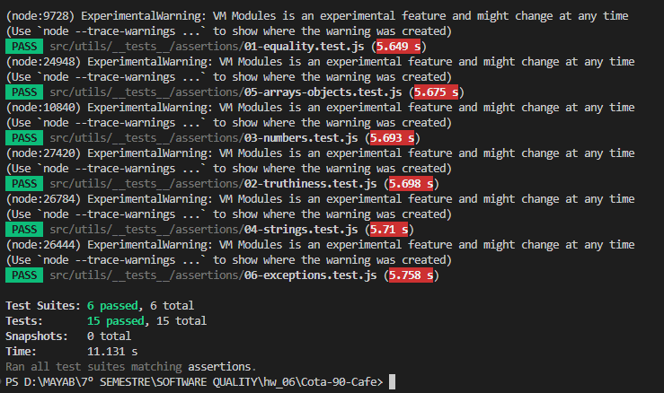

# Cota 90 Café – HW07: Unit Test Assertions with Jest

An online store for specialty coffee built with **React + Vite**. This branch
covers the **6 assertion types** of Jest, ordered from the simplest to the most
complex, using the **AAA pattern** (Arrange, Act, Assert). The full test plan is
in [`UNIT_TEST_PLAN.md`](UNIT_TEST_PLAN.md).

## Test results

All 6 assertion files pass: **6 test suites, 15 tests**.



## How the tests are organized

```
src/utils/
├── granos.js            ← catalog logic (used by App.jsx and GranoItem.jsx)
├── chat.js              ← chat bot answers (used by ChatWidget.jsx)
├── SlideNavigator.js    ← carousel navigation (used by Carousel.jsx)
├── pedido.js            ← order logic: prices, shipping, wholesale (new in HW07)
└── __tests__/
    ├── granos.test.js            ← HW06
    ├── SlideNavigator.test.js    ← HW06
    └── assertions/               ← HW07, one file per assertion type
        ├── 01-equality.test.js
        ├── 02-truthiness.test.js
        ├── 03-numbers.test.js
        ├── 04-strings.test.js
        ├── 05-arrays-objects.test.js
        └── 06-exceptions.test.js
```

Each test follows AAA, with the three steps separated by a blank line:
**Arrange** (prepare the input), **Act** (call the code), **Assert** (`expect`).

---

## What each test file does

### 1. `01-equality.test.js` – Equality

**Matchers:** `toBe`

**Code it tests:** [`getRegion`](src/utils/granos.js#L7) in `src/utils/granos.js`.
The web page uses it in `App.jsx` to build the region filter buttons.

| Test | What it checks |
| --- | --- |
| A1-01 | The origin `'Panamá – Chiriquí'` returns exactly `'Panamá'`. |

This is the simplest assertion: one input, one call, one exact value.

### 2. `02-truthiness.test.js` – Truthiness

**Matchers:** `toBeTruthy`, `toBeFalsy`, `toBeNull`, `toBeDefined`

**Code it tests:**
- [`qualifiesForFreeShipping`](src/utils/pedido.js#L19) in `src/utils/pedido.js`.
- [`getChatResponse`](src/utils/chat.js#L24) in `src/utils/chat.js`, which the chat window (`ChatWidget.jsx`) uses to answer messages.

| Test | What it checks |
| --- | --- |
| A2-01 | A $650 purchase gets free shipping (true). |
| A2-02 | A purchase of exactly $500 does **not** get free shipping (false). This is the boundary, because the rule is "over $500". |
| A2-03 | The chat returns `null` for a blank message and returns an answer for `'tueste'`. |

### 3. `03-numbers.test.js` – Numbers

**Matchers:** `toBeGreaterThan`, `toBeLessThan`, `toBeCloseTo`

**Code it tests:**
- [`parsePrice`](src/utils/pedido.js#L11): turns a price written like `"$1,250.50"` into a number.
- [`calculateOrderTotal`](src/utils/pedido.js#L22): adds up an order, applies the wholesale discount and the shipping cost.

| Test | What it checks |
| --- | --- |
| A3-01 | `'$1,250.50'` becomes a number between 1250 and 1251. |
| A3-02 | 3 × $19.99 gives a subtotal close to 59.97, $99 shipping, and a total close to 158.97. `toBeCloseTo` is used because decimals in JavaScript are not always exact. |
| A3-03 | 10 units of $345.50 get a 10% wholesale discount ($345.50), so the total ($3,109.50) is less than the subtotal. |

### 4. `04-strings.test.js` – Strings

**Matchers:** `toMatch`, `not.toMatch` (with regular expressions)

**Code it tests:**
- [`getIntensityBeans`](src/utils/granos.js#L21): the 🔥/⚪ icons shown on each coffee card (`GranoItem.jsx`).
- [`getChatResponse`](src/utils/chat.js#L24): the chat answers.

| Test | What it checks |
| --- | --- |
| A4-01 | Intensity 4 is exactly four 🔥 followed by one ⚪. |
| A4-02 | Asking `'¿Cuánto cuesta el ENVIO?'` (in capitals) returns the shipping answer: it mentions "envío gratis" and "$500", and does not mention "mayoreo". |

### 5. `05-arrays-objects.test.js` – Arrays and objects

**Matchers:** `toContain`, `toHaveLength`, `toEqual`, `toHaveProperty`, `toMatchObject`

**Code it tests:**
- [`getRegions`](src/utils/granos.js#L10): the list of filter buttons in `App.jsx`.
- [`calculateOrderTotal`](src/utils/pedido.js#L22): the order summary object.

| Test | What it checks |
| --- | --- |
| A5-01 | With 3 beans from México and 1 from Kenia, the list has 3 buttons (`'Todos'`, `'México'`, `'Kenia'`), contains `'México'` once and does not contain `'Oaxaca'`. The catalog is prepared in `beforeEach`. |
| A5-02 | The order summary has a `total` field, has the expected units, subtotal and shipping, and matches the full object exactly. |

### 6. `06-exceptions.test.js` – Exceptions

**Matchers:** `toThrow` (by error type, message and pattern)

**Code it tests:**
- [`getIntensityBeans`](src/utils/granos.js#L21)
- [`parsePrice`](src/utils/pedido.js#L11)
- [`calculateOrderTotal`](src/utils/pedido.js#L22)
- [`SlideNavigator.goTo`](src/utils/SlideNavigator.js#L22): the carousel dots (`Carousel.jsx`).

| Test | What it checks |
| --- | --- |
| A6-01 | Intensity 7 throws a `RangeError` with the message "entre 0 y 5". |
| A6-02 | Four badly written prices (`'320'`, `'$3.2.0'`, `''`, `null`) each throw a `TypeError`. |
| A6-03 | An empty order throws "El pedido está vacío", and a quantity of 0 throws a `RangeError`. |
| A6-04 | Going to slide 9 of 5 throws "fuera de rango", and the carousel stays on the slide it was on. |

This is the most complex type: the call must be wrapped in a function
(`() => ...`) so Jest can catch the error, and A6-04 also checks that the error
did not change the object's state.

---

## HW06 test files (also on this branch)

| File | Code it tests | What it checks |
| --- | --- | --- |
| `granos.test.js` | [`fetchGranos`](src/utils/granos.js#L29), [`filterByRegion`](src/utils/granos.js#L15) | Loads the catalog through a fake HTTP client, and filtering by "México" returns only the Mexican beans. |
| `SlideNavigator.test.js` | [`SlideNavigator.next`](src/utils/SlideNavigator.js#L12) | From the last slide, `next()` goes back to the first one. |

## New functions in HW07

The assignment allows adding functions to support the tests. These are in
[`src/utils/pedido.js`](src/utils/pedido.js) and use the rules the site's chat
already announces (free shipping over $500 and wholesale prices). They are
tested, but the web page does not use them yet.

| Function | What it does |
| --- | --- |
| `parsePrice(price)` | Converts `"$1,250.50"` into `1250.5`; throws `TypeError` for invalid prices. |
| `qualifiesForFreeShipping(subtotal)` | `true` when the purchase is over $500. |
| `calculateOrderTotal(lines)` | Returns `units`, `subtotal`, `discount` (10% from 10 units), `shipping` ($99 or free) and `total`. |

## How to run

```bash
npm install
npm test                    # all tests
npm test -- assertions      # only the HW07 assertion tests
npm test -- 03-numbers      # a single file
```

Because the project uses ES modules (`"type": "module"`), the `test` script
runs Jest with `--experimental-vm-modules`. The "ExperimentalWarning" lines in
the terminal come from that option and are not errors.

## Use of AI

The order functions in `pedido.js`, the assertion test files, the test plan
and this README were made with the help of AI (Claude).

> *How it helped (to be completed by the student):*

## Submission

Delete the `node_modules/` folder before zipping the project (it is already
excluded in `.gitignore`).
